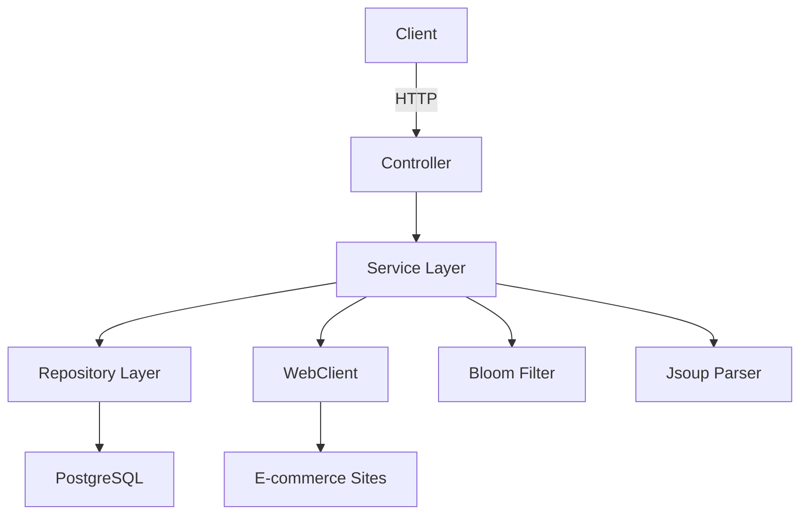

# EComm_Product_URL_Crawler


A scalable web crawler designed to discover and catalog product URLs across multiple e-commerce websites, built with Java Spring Boot.

## Features

- **Intelligent URL Discovery**: Identifies product pages using common URL patterns (`/product/`, `/item/`, `/p/`)
- **Parallel Processing**: Uses Spring WebFlux for asynchronous crawling
- **Domain Management**: Tracks crawling status for each domain
- **REST API**: Provides endpoints for controlling and monitoring the crawler
- **Scheduled Execution**: Automatically runs daily crawls
- **Bloom Filter**: Efficient URL tracking to prevent duplicates
- **Robots.txt Compliance**: Respects website crawling policies

## Technology Stack

- **Backend**: Spring Boot 3.x
- **Database**: PostgreSQL
- **HTML Parsing**: Jsoup
- **Asynchronous Processing**: Project Reactor
- **URL Tracking**: Guava Bloom Filter
- **API Documentation**: SpringDoc OpenAPI (Swagger UI)
- **Testing**: JUnit 5, Mockito

## Getting Started

### Prerequisites

- Java 17 JDK
- Maven 3.8+
- PostgreSQL 13+ (or Docker)
- Optional: Docker for containerized deployment

### Installation

1. Clone the repository:
   ```bash
   git clone https://github.com/rhazra-003/EComm_Product_URL_Crawler.git
   cd ecommerce-crawler
   ```

2. Configure PostgreSQL:
   - Create a database named `ecommerce_crawler`
   - Update `application.properties` with your credentials

3. Build the application:
   ```bash
   mvn clean install
   ```

### Running the Application

**Option 1: Using Maven**
```bash
mvn spring-boot:run
```

**Option 2: Using Docker**
```bash
docker-compose up --build
```

The application will be available at `http://localhost:8080`

## API Endpoints

| Endpoint | Method | Description |
|----------|--------|-------------|
| `/api/crawler/init` | POST | Initialize domains for crawling |
| `/api/crawler/start` | POST | Start crawling process |
| `/api/crawler/status` | GET | Get current crawling status |
| `/api/crawler/domains` | GET | List all tracked domains |
| `/api/crawler/products/{domainId}` | GET | Get product URLs for a domain |

**Example API Call:**
```bash
curl -X POST -H "Content-Type: application/json" -d '["https://www.virgio.com/","https://www.tatacliq.com/"]' http://localhost:8080/api/crawler/init
```

## Configuration

Configure the application via `application.properties`:

```properties
# Database
spring.datasource.url=jdbc:postgresql://localhost:5432/ecommerce_crawler
spring.datasource.username=postgres
spring.datasource.password=yourpassword

# Crawling
crawler.max-depth=5
crawler.timeout=30000
crawler.user-agent=Mozilla/5.0 (compatible; EcommerceCrawler/1.0)

# Scheduling
crawler.schedule.cron=0 0 2 * * *  # Runs daily at 2 AM
```

## Monitoring

Access the built-in monitoring endpoints:

- Health: `http://localhost:8080/actuator/health`
- Metrics: `http://localhost:8080/actuator/metrics`
- Prometheus: `http://localhost:8080/actuator/prometheus`

## Swagger Documentation

API documentation is available at:
`http://localhost:8080/swagger-ui.html`

## Architecture Diagram



## Development

### Running Tests

```bash
mvn test
```

### Code Style

This project uses Google Java Style. Format your code with:

```bash
mvn spotless:apply
```

## Deployment

### Docker Production Build

1. Build the Docker image:
   ```bash
   docker build -t ecommerce-crawler .
   ```

2. Run with production profile:
   ```bash
   docker run -e "SPRING_PROFILES_ACTIVE=prod" -p 8080:8080 ecommerce-crawler
   ```

### Kubernetes

Sample deployment manifest:
```yaml
apiVersion: apps/v1
kind: Deployment
metadata:
  name: ecommerce-crawler
spec:
  replicas: 3
  selector:
    matchLabels:
      app: crawler
  template:
    metadata:
      labels:
        app: crawler
    spec:
      containers:
      - name: crawler
        image: ecommerce-crawler:latest
        ports:
        - containerPort: 8080
        env:
        - name: SPRING_PROFILES_ACTIVE
          value: "prod"
```

## Contributing

1. Fork the project
2. Create your feature branch (`git checkout -b feature/AmazingFeature`)
3. Commit your changes (`git commit -m 'Add some AmazingFeature'`)
4. Push to the branch (`git push origin feature/AmazingFeature`)
5. Open a Pull Request

## License

Distributed under the MIT License. See `LICENSE` for more information.
